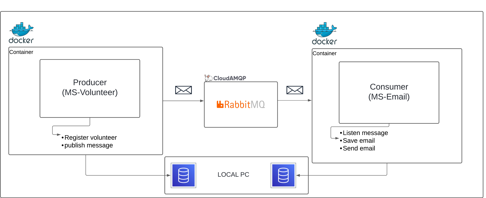

# Volunteer Registration System with send email notification

In this project, I have created a simple volunteer registration system with email notification. The system is developed with Java Language and Spring Boot. The system allows volunteers to register themselves by providing their details. Once a volunteer registers, an email notification is sent to the volunteer's email address with SMTP protocol. The email contains a sample message.

The objective of this project is to demonstrate how to send email notifications in a Spring Boot application. The project is developed with the following technologies:

- Java
- Spring Boot
- Spring Mail
- CLOUDAMQP (RabbitMQ as a Broker)

The image below shows the system architecture:



The system architecture consists of the following components:

- 2 Containers Docker with 2 Microservices: Volunteer Service and Email Service
- PostgreSQL as a database for every microservice
- CloudAMQP using RabbitMQ as a broker

The Volunteer Service is responsible for handling the registration of volunteers. The Email Service is responsible for sending email notifications to volunteers. The Email Service listens to the RabbitMQ queue for new email notifications. When a new email notification is received, the Email Service sends an email to the volunteer's email address.

In this especificly project, I'm using the databases in my PC, but I'm recommend to use the docker-compose to create the databases in the containers for each microservice.

## How to Run the Project

For each root directory has a file called Dockerfile, this file is responsible for creating the Docker image for each microservice.
To run the project, you need to have Docker installed on your machine. Later, you can run the following commands:

1. Clone the repository:

    ```bash
    git clone https://github.com/Alysson-Araujo/volunteer-registration-system.git
    ```

2. Go to the root directory of the projects email and volunteer to create the Docker images and run the containers:

    
    ```bash
    docker build -t ms-volunteer .
    ```

    ```bash
    docker run -p 8081:8081 -d --name container-ms-volunteer ms-volunteer
    ```

    ```bash
    docker build -t ms-email .
    ```

    ```bash
    docker run -p 8082:8082 -d --name container-ms-email ms-email
    ```

## routes

In the volunteer service, we have a sample route to register a volunteer:

- POST /volunteers

The request body should contain the following fields:
```json
{
    "name": "Junior",
    "email":"junior@example.com",
    "phone":"123456789",
    "function":"OUTROS",
    "pollingStation":"1"
}
```

The example above shows how to register a volunteer. In the function field, you can choose one of the following options: "TENDIMENTO", "LIMPEZA", "ORGANIZACAO" and "OUTROS".

The email service has no routes. It listens to the RabbitMQ queue for new email notifications, saves the email notification to the database, and sends an email to the volunteer's email address.

## Reminder

**You can configure the environment variables in the application.properties file in each microservice to connect to the database and RabbitMQ. The application.properties file is located in the resources folder of each microservice.**
